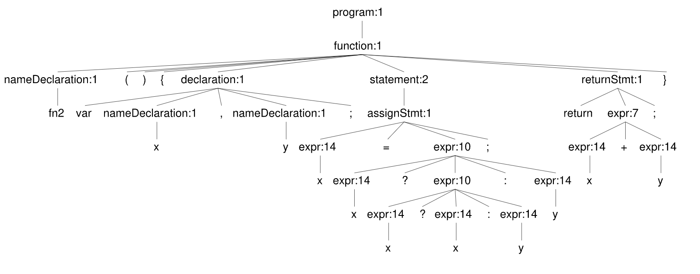

# Deliverable 1: Extending the TIP parser to the SIP parser

By:

- William Kaiser (xbk6xm@virginia.edu)
- Varun Varma (kgy6hy@virginia.edu)

## Overview

During this project, the Tiny Imperative Programming (TIP) Language had the grammar used be extended to the SIP language constructs. 

## Challenges

When developing the grammar, we tried to add the ternary expression as a separate rule like `recordExpr` or `arrayExpr`, but that caused left-recursion issues. We added the ternary rule directly to the `expr` rule to fix the problem. We also had the tendency to be too specific when writing the grammar for operators, but we realized that just using `expr` for most things is better.

```console
expr : expr '(' (expr (',' expr)*)? ')' 	#funAppExpr
     | expr '.' IDENTIFIER 		#accessExpr
     | '*' expr 				#deRefExpr
     | SUB NUMBER				#negNumber
     | SUB expr                    #negExpr
     | '&' expr				#refExpr
     | '#' expr                    #arrayLength
     | KNOT expr                   #notExpr
     | expr op=(MUL | DIV | MOD) expr 		#multiplicativeExpr
     | expr op=(ADD | SUB) expr 		     #additiveExpr
     | expr op=(GT | LTE | GTE | LT) expr    #relationalExpr
     | expr op=(EQ | NE) expr 			#equalityExpr
     | expr '?' expr ':' expr      #ternaryExpr
     | expr '[' expr ']'           #arrayIndexingExpr
     | IDENTIFIER				#varExpr
     | NUMBER					#numExpr
     | KINPUT					#inputExpr
     | KALLOC expr				#allocExpr
     | KNULL					#nullExpr
     | op=(KTRUE | KFALSE)         #boolExpr
     | recordExpr				#recordRule
     | arrayExpr                   #arrayLiteral
     | expr op=(LOR | LAND) expr   #nonShortCircuiting
     | expr op=(KAND | KOR) expr   #boolOps
     | '(' expr ')'				#parenExpr
;
```

## Workflow

Development of the grammar was completed in the [ANTLR Lab](http://lab.antlr.org/) to rapidly make changes without needing to rebuild the project each time. In addition to being faster to prototype, using the ANTLR lab ensured that certain features of the new language, namely, nested ternaries were parsed properly.

For example, the following SIP program was parsed into:

```c
fn2() { 
     var x, y;
     x = x ? x ? x : y : y; 
     return x + y; 
}
```



## Testing

A markdown file [Deliverable 1](./docs/deliverables/deliverable1.md) was used as a working document to coordinate the delegation of testing between the group members. While the scope of all tests was followed as initially described, a few tests were merged using the existing tests in `TIPParserTest.cpp` expressed the same pattern. For instance, a general test `SIP Parser: operators` was used to test multiple operators in a single test.

We had a little trouble getting the operator precedence tests to work because they required the expected strings to be very exact, but we solved that by just printing the full tree outputs and viewing the proper syntax. Because of our tests, we were able to find and fix bugs with negation precedence.

We think our testing is complete because all the instances of each new feature were tested for passibility. We also added various precedence tests for each type of new operator. We added a bunch of new tests for the new unary and ternary operators, but for the new binary operators we mostly showed precedence equivalence with other already added binary operators. If we know they are equivalent, then any errors with the new binary operators will fail the existing binary operator tests in the TIPC parser unit tests. 